# shift-add-multiplication-10-bit
## Shift/Add multiplication 10-bit

This project implements a structural 10-bit Shift/Add Multiplier designed using VHDL. The architecture is developed hierarchically, starting from basic logic gates and building up to a fully registered multiplication system suitable for ASIC synthesis.

## Project Overview

The multiplier uses the Shift/Add algorithm, which processes two 10-bit inputs (multiplier $a$ and multiplicand $b$) over 10 clock cycles. In each cycle, the system checks the least significant bit (LSB) of the current partial product:
If the bit is 1: The multiplicand is added to the partial product.
If the bit is 0: No addition occurs.
Final Step: The result is shifted to prepare for the next bit until the 20-bit product is finalized.

## Architecture
The design is organized into several key layers such as **Low-Level Components** e.g. logic gates, storage elements and arithmetic units. The last ones are combined into a **Carry Propage Adder (CPA)** to handle n-bit additions. Also, a **Control Unit** is implemented which manages the sequence of operations, including loading initial values, triggering shifts, and monitoring the internal counter to detect the end of the multiplication.

## Verification

Apart from the implementation of a **testbench** to verify the functional simulation, the design was verified through a complete digital IC design flow. More specifically, with the help of **Cadence Genus** the *logic synthesis* is performed for both 7nm and 45nm technologies to analyze timing, power, and area . Additionally, the design was *placed and routed* using **Cadence Innovus**, passing Connectivity and Design Rule Checks (DRC). The *logical equivalence* between the VHDL source and the synthesized netlist was confirmed via **LEC**. Finally, it was tested with an **Xcelium** testbench using various inputs to confirm mathematical accuracy for functional simulation. 

  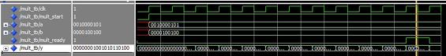
  
<b>Image 1: ModelSim Testbench (Xcelium Simulation)</b>

  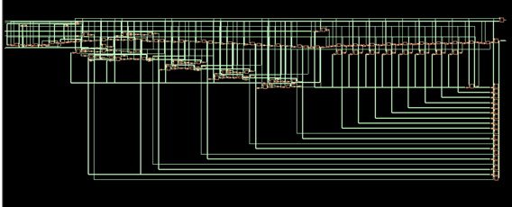
  
<b>Image 1: Genus Synthesis (7nm)</b>

 

  <table style="border: none; border-collapse: collapse;">
    <tr style="border: none;">
      <td style="border: none; padding: 5px;">
        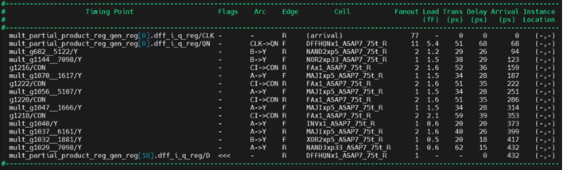
      </td>
      <td style="border: none; padding: 5px;">
        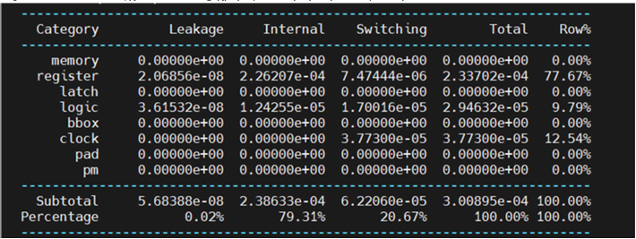
      </td>
      <td style="border: none; padding: 5px;">
        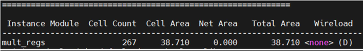
      </td>
    </tr>
  </table>
  
<b>Image 4: Genus Reports (Timing / Power / Area)</b>

 

  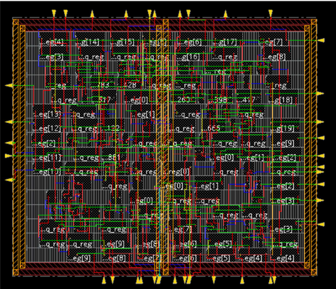
  
<b>Image 3: Innovus Standard Cell Placement & Routing</b>

 

  <table style="border: none; border-collapse: collapse;">
    <tr style="border: none;">
      <td style="border: none; padding: 5px;">
        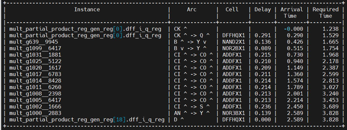
      </td>
      <td style="border: none; padding: 5px;">
        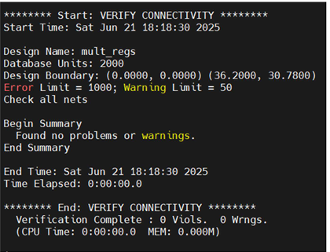
      </td>
      <td style="border: none; padding: 5px;">
        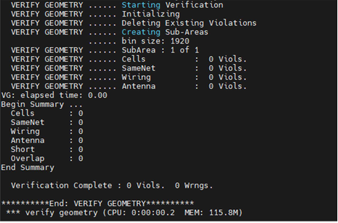
      </td>
    </tr>
  </table>
  
<b>Image 4: Innovus Reports (Timing / Connectivity / Geometry)</b>

 

  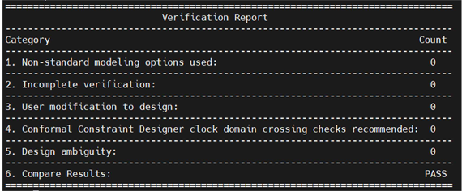
  
<b>Image 5: LEC verification</b>

  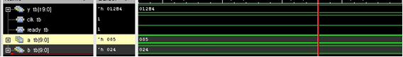
  
<b>Image 6: Xcelium testbench</b>

## Conclusion

The project successfully demonstrated the design and hardware implementation of a 10-bit Shift/Add Multiplier through a complete ASIC design flow. By utilizing a structural VHDL approach, the design ensures scalability and modularity, allowing for clear verification at every stage of the hierarchy. The implementation was verified through Xcelium simulations, confirming that the shift-and-add algorithm correctly produces a 20-bit product over the required 10-cycle period. The design passed DRC and Connectivity checks in the layout phase, and LEC (Logic Equivalence Check) confirmed that the final synthesized netlist remains logically identical to the original VHDL source.
The final system provides a stable, registered multiplication module that effectively balances complexity with performance, meeting all the specified design requirements.
